===================================================
Introduction to **Sphinx** documentation generator
===================================================

Who are you?
=============

.. figure:: face.png

http://about.me/shimizukawa,
@shimizukawa

* Activity:

  * Sphinx co-maintainer
  * Sphinx-users.jp chairman
  * PyCon JP 2011,2012 vice-chairman

.. s6:: effect slide

.. s6:: styles

    'div[0]': {width:'15%', position:'absolute', top:'0'},

.. speech::

   Hi everyone.

   My name is Takayuki Shimizukawa, I came from Japan.
   I joined the PyConTW last year, and it is my second time to come to Taiwan.

   My activity in Sphinx,
   I am a Sphinx co-maintainer and a Sphinx-uses.jp chariman.
   And Python, I was a vice-chairman PyCon JP 2011, 2012.

.. todo:: As co-maintainer, I study about ??????

Books
========

* Expert Python Programming (translation into Japanese)

  .. figure:: book-epp.jpg

* Python Professional Programming (2 chapters)

  .. figure:: book-pypro.png

.. s6:: effect slide

.. s6:: styles

   'ul/li[0]/p': {width: '50%', marginBottom:'0.5em'},
   'ul/li[0]/div': {width:'30%', left:'55%', top:'1em'},
   'ul/li[1]': {marginLeft: '2em'},
   'ul/li[1]/p': {width: '50%'},
   'ul/li[1]/div': {width:'30%', right:'0', bottom:'0em'},

.. speech::

   Books.

   * I want to show you my books. There are 2 books so far, each books tell
     you about Python Programming. Writing books is one of my most
     interesting skills.

   .. * The "Expert Python Programming" that written by Tarek Ziade in 2008.
   ..   I and other 3 members translated in 2010, about 3 years ago.
   ..
   .. * In 2012, The "Python Professional Programming" was written by 14
   ..   colleagues of the company I belong. I wrote two chapters.

   * These 2 books mentions to Sphinx and Documentation.

   * "Python Professional Programming" was already translated into
     'simple chineese charactors' and will publish soon.

anyway.
=========

.. s6:: styles

   'h2': {textAlign:'center', margin:'30% auto', lineHeight:'1.5em'}

The Sphinx
============

.. figure:: sphinx-logo.png

.. speech::

   The Sphinx.
   Today, I'll talk about documentation generator that is called "Sphinx".

.. s6:: effect fadeScaleFromUp

.. s6:: styles

   'h2': {fontSize:'120%', textAlign:'center'},
   'div[0]/img': {margin:'20% 10%', width:'90%'},
   'div/img': {border:'0.1em gray outset'},

Table of contents
==================

1. Introduction
2. Demonstration
3. Case studies

.. speech::

   I will tell about Sphinx by three parts.
   Introduction, Demonstration and Case studies.

.. s6:: effect slide

Table of contents
====================
1. Introduction

   * Introduces the Sphinx and reStructuredText.
   * Sphinx extensions.
   * Comparison with other documentation tools.

2. Demonstration
3. Case studies

.. speech::

   First, I'll introduce "what is Sphinx" and "what is reStructuredText".

.. s6:: styles

   'ol': {color: 'gray'},
   'ol/li[0]/ul/li[0]': {color: 'white'},

.. todo:: how many people already using Sphinx? or any other documentation tool?

.. todo:: Why do we need the documentation?

What **IS** Sphinx?
=====================

.. speech::

   What is Sphinx?

.. s6:: styles

   'h2': {textAlign:'center', margin:'30% auto', lineHeight:'1.5em'}

.. s6:: effect slide

Sphinx **IS**
===============

* Documentation generator.
* Sphinx generate documentation from reStructuredText markup.
* Extendable.

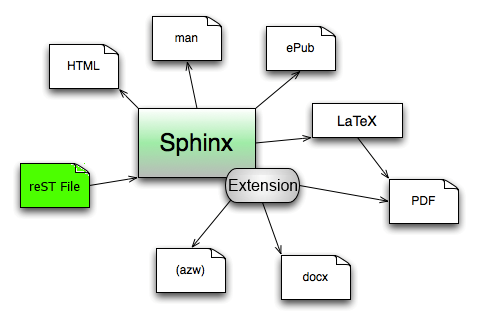

.. speech::

   * Sphinx is a documentation generator.
     Sphinx generate documentation from reStructuredText markup.

     In other words, Sphinx reads reStructuredText format text file and
     outputs html, epub, pdf, or other several format.

   * Sphinx is extendable, so you can also output in a different format,
     or read the file in a different format.

.. s6:: styles

   'div': {width:'55%', position:'absolute', right:'0', bottom:'1em', backgroundColor:'white'}

.. s6:: effect slide

And reStructuredText(reST) **IS**
==================================

* Markup language.
* Written with plain text.
* Similer to several wiki markups.
* Extendable **(important!)**

There is markup sample:

.. code-block:: rst

   reStructuredText_ (*reST*) is **markup** language.
   :rst:role:`role` and :rst:dir:`directive` is extendable.

   .. _reStructuredText: http://docutils.sourceforge.net/docs/ref/rst/restructuredtext.html

.. speech::

   And reStructuredText reST is markup language.

   * It was written with plain text.
   * reST is similer to other wiki like markups.
     But reST is different from others, it is extendable syntax.
     It's a important point.

   This is a markup sample that contains LINK, EMPHASIS, STRONG and ROLE.

.. s6:: styles

   'ul': {fontSize: '80%'},
   'div': {fontSize: '80%'},

.. s6:: effect slide

Sphinx extends reST syntax
===========================

Sphinx provides many useful reST :term:`directive` and :term:`role`.

* :ref:`code-block <code-examples>`: Code highlight directive
* :rst:role:`doc`, :rst:role:`ref`, :rst:role:`term`:
  Link to other pages roles and directives
* :rst:dir:`math`: Numerical formula directive
* :rst:dir:`only`: Conditional output directive.
* :rst:dir:`automodule`: Auto documenter from .py directive.
* :ref:`domains <domains>`: Some domains directives and roles: C, C++, JavaScript, Python, reST.

.. speech:: 

   Sphinx provides many useful reST directive and role.

   * code-block for code highlighting.
   * doc, ref, term, these roles make link to other pages.
   * math role and directive render numerical formula.
   * only directive works as conditional output control.
   * automodule generate module reference document from .py file.
   * Some domains directives and roles: C, C++, JavaScript, Python, reST.

.. todo:: domainsの部分がうまく説明出来ていない

.. s6:: styles

   'ul': {fontSize: '60%'},
   'p': {fontSize: '70%'},

.. s6:: effect slide

Sphinx includes
====================

Simple and beautiful html themes. Detail information is here: :ref:`builtin-themes`.

.. figure:: theme-default.png

   default

.. figure:: theme-sphinxdoc.png

   sphinxdoc

.. figure:: theme-scrolls.png

   scrolls

.. figure:: theme-agogo.png

   agogo

.. figure:: theme-traditional.png

   traditional

.. figure:: theme-nature.png

   nature

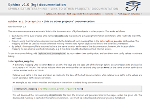

   haiku

.. figure:: theme-pyramid.png

   pyramid

.. speech::

   Sphinx includes simple and beautiful html themes.
   default, sphinxdoc, scrolls, agogo, traditional, nature, haiku and pyramid.

   Detail information is written at builtin themes page.

.. s6:: styles

   'div[0]': {fontSize:'60%', width:'23%', float:'left', margin:'0.2em 0 0.2em 0.5em'},
   'div[1]': {fontSize:'60%', width:'23%', float:'left', margin:'0.2em 0 0.2em 0.5em'},
   'div[2]': {fontSize:'60%', width:'23%', float:'left', margin:'0.2em 0 0.2em 0.5em'},
   'div[3]': {fontSize:'60%', width:'23%', float:'left', margin:'0.2em 0 0.2em 0.5em'},
   'div[4]': {fontSize:'60%', width:'23%', float:'left', margin:'0.2em 0 0.2em 0.5em'},
   'div[5]': {fontSize:'60%', width:'23%', float:'left', margin:'0.2em 0 0.2em 0.5em'},
   'div[6]': {fontSize:'60%', width:'23%', float:'left', margin:'0.2em 0 0.2em 0.5em'},
   'div[7]': {fontSize:'60%', width:'23%', float:'left', margin:'0.2em 0 0.2em 0.5em'},

.. s6:: effect slide

There are 3rd party themes
============================

You can find 3rd-party Sphinx themes at PyPI or other sites. For example,

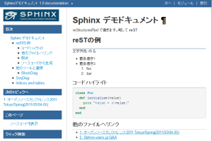

   bizstyle_

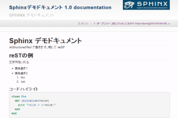

   dotted_

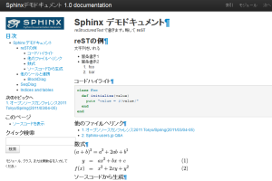

   basicstrap_

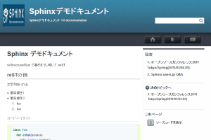

   sphinxjp_

And presentation themes:

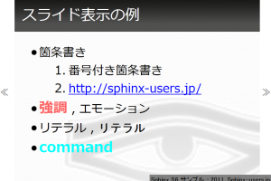

   s6_

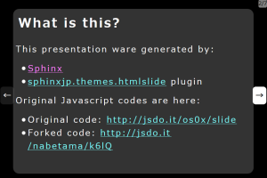

   htmlslide_

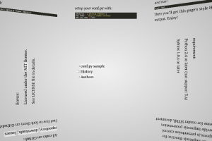

   impressjs_

.. s6:: styles

   'div[0]': {fontSize:'60%', width:'23%', float:'left', margin:'0.2em 0 0.2em 0.5em'},
   'div[1]': {fontSize:'60%', width:'23%', float:'left', margin:'0.2em 0 0.2em 0.5em'},
   'div[2]': {fontSize:'60%', width:'23%', float:'left', margin:'0.2em 0 0.2em 0.5em'},
   'div[3]': {fontSize:'60%', width:'23%', float:'left', margin:'0.2em 0 0.2em 0.5em'},
   'div[4]': {fontSize:'60%', width:'23%', float:'left', margin:'0.2em 0 0.2em 0.5em'},
   'div[5]': {fontSize:'60%', width:'23%', float:'left', margin:'0.2em 0 0.2em 0.5em'},
   'div[6]': {fontSize:'60%', width:'23%', float:'left', margin:'0.2em 0 0.2em 0.5em'},
   'p': {clear:'both'},

.. speech::

   There are 3rd party themes.
   You can find 3rd-party Sphinx themes at PyPI or other sites. For example,
   bizstyle, dotted, basicstrap and sphinxjp.

   And few presentation themes are also exist:
   s6, htmlslide, impressjs.

.. s6:: effect slide

.. _bizstyle: https://pypi.python.org/pypi/sphinxjp.themes.bizstyle
.. _dotted: https://pypi.python.org/pypi/sphinxjp.themes.dotted
.. _basicstrap: https://pypi.python.org/pypi/sphinxjp.themes.basicstrap
.. _sphinxjp: https://pypi.python.org/pypi/sphinxjp.themes.sphinxjp
.. _s6: https://pypi.python.org/pypi/sphinxjp.themes.s6
.. _htmlslide: https://pypi.python.org/pypi/sphinxjp.themes.htmlslide
.. _impressjs: https://pypi.python.org/pypi/sphinxjp.themes.impressjs

What **IS NOT** Sphinx?
========================

.. speech:: So, I'll also introduce Sphinx is not possible.

.. s6:: styles

   'h2': {textAlign:'center', margin:'30% auto', lineHeight:'1.5em'}

What **IS NOT** Sphinx?
========================

* Are there *GUI frontend editor?*
   * **NO.**

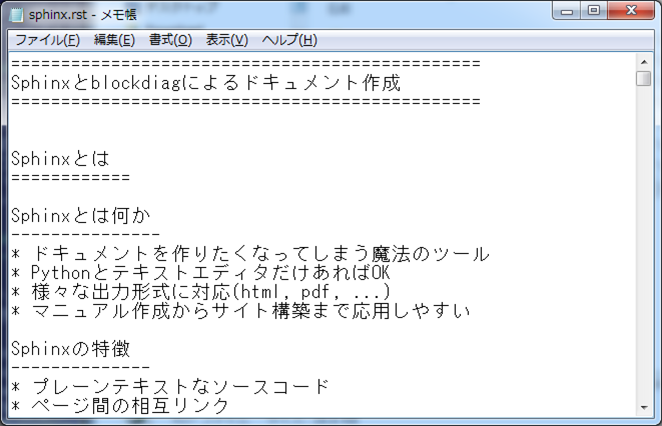

   Windows Notepad

.. speech::

   Sphinx did not have GUI frontend as like as Word.
   But you can choose any GUI editor to edit reST.

.. s6:: styles

   'div': {width:'60%', margin:'1em auto'},

.. s6:: effect slide

What **IS NOT** Sphinx?
========================

* There is a way to import/export *Word*?
   * **NO..!**

.. todo:: Image

.. speech::

   Sphinx did not have a way to import Word file.
   There is a experimental implementation to export to Word file,
   but it is not stable.

.. s6:: effect slide

What **IS NOT** Sphinx?
========================

* There is a way to export to *PowerPoint*?
   * **NO.....!!!**

.. todo:: Image

.. speech::

   3rd-party theme will support to make presentation slide by using Sphinx.
   But it is controlled by HTML, css and JavaScript.
   It is not easy to convert PowerPoint file format.

.. s6:: effect slide

What **IS NOT** Sphinx?
========================

* Are there a way to export to *Excel*?
   * **What are you saying???**

.. todo:: Image

.. speech::

   Do you know Excel HOUGAN-SHI? HOUGAN-SHI means "Squares of paper".
   In Japan, many many documentations has been made with Excel HOUGAN-SHI.
   It is not feasible I think because it is not easy to maintenance and
   not easy to recognize difference by changing.

.. s6:: effect slide

Conclusion: Sphinx **IS**
===========================

* Documentation generator.
* Read reST and write several file formats.
* Extends reST syntax and provides many useful
  *roles* and *directives*.
* Contains many beautiful HTML themes.
* Extendable.

.. speech::

   (read slide.)

.. s6:: styles

    'ul/li': {display:'none'}

.. s6:: actions

    ['ul/li[0]', 'fade in', '0.3'],
    ['ul/li[1]', 'fade in', '0.3'],
    ['ul/li[2]', 'fade in', '0.3'],
    ['ul/li[3]', 'fade in', '0.3'],
    ['ul/li[4]', 'fade in', '0.3'],

.. s6:: effect slide

Next.
======

.. s6:: styles

   'h2': {textAlign:'center', margin:'30% auto', lineHeight:'1.5em'}

.. s6:: effect slide

Table of contents
====================
1. Introduction

   * Introduces the Sphinx and reStructuredText.
   * Sphinx extensions.
   * Comparison with other documentation tools.

2. Demonstration
3. Case studies

.. s6:: styles

   'ol': {color: 'gray'},
   'ol/li[0]/ul/li[1]': {color: 'white'},

Sphinx include official extensions
====================================

* autodoc: Auto documenter from .py
* pngmath or jsmath: provides :rst:dir:`math` directive and role.
* intersphinx: Link other documents over internet.
* graphviz: Draw graphics by using graphviz.
* todo: List-up todo directives.
* doctest: ?????
* coverage: ?????

.. todo:: 書く

.. s6:: effect slide

There are many 3rd-party extensions
====================================

* blockdiag: Rendering diagrams from plain-text.
* Some type of html theme.
* Domains: ada, coffee, erlan, http, php, ruby.

.. speech::

   * blockdiag: Rendering diagrams from plain-text.
   * Some type of html theme. already I introduced.
   * Extra domains: ada, coffee, erlan, http, php, ruby.

.. s6:: effect slide

Next.
======

.. s6:: styles

   'h2': {textAlign:'center', margin:'30% auto', lineHeight:'1.5em'}

.. s6:: effect slide

Table of contents
====================
1. Introduction

   * Introduces the Sphinx and reStructuredText.
   * Sphinx extensions.
   * Comparison with other documentation tools.

2. Demonstration
3. Case studies

.. s6:: styles

   'ol': {color: 'gray'},
   'ol/li[0]/ul/li[2]': {color: 'white'},

Compare with other tools
=========================

* Word
* Excel
* Wiki

.. s6:: effect slide

Sphinx vs Word
================

TBD

.. todo:: write

.. s6:: effect slide

Sphinx vs Excel
=================

TBD

.. todo:: write

.. s6:: effect slide

Sphinx vs Wiki
================

TBD

.. todo:: write

.. s6:: effect slide

Next.
======

.. s6:: styles

   'h2': {textAlign:'center', margin:'30% auto', lineHeight:'1.5em'}

.. s6:: effect slide

Table of contents
====================
1. Introduction
2. Demonstration
3. Case studies

.. s6:: styles

   'ol': {color: 'gray'},
   'ol/li[1]': {color: 'white'},

Sphinx installation
=====================

Install from PyPI:

.. code-block:: bash

  $ easy_install Sphinx
  Searching for Sphinx
  Reading http://pypi.python.org/simple/Sphinx/
  Best match: Sphinx 1.2b1
  ...
  Finished processing dependencies for Sphinx

Sphinx and other dependency packages are installed.
Sphinx 1.2b1 is current newest version.

.. speech::

   easy_install is defacto standard package installer.
   There are other installation methods: pip, buildout or invoke setup.py.

.. s6:: styles

   'p': {fontSize:'70%'},
   'div': {fontSize:'70%'},

.. s6:: effect slide

Sphinx quick start
=====================

Generate scaffold by sphinx-quickstart:

.. code-block:: bash

  $ sphinx-quickstart sample
  (many interactive questions)

Make html:

.. code-block:: bash

  $ cd sample
  $ make html

.. s6:: styles

   'p': {fontSize:'70%'},
   'div': {fontSize:'70%'},

.. s6:: effect slide

demo menu
==============

* Bullet list
* Numbered list
* Code highlight
* Link to other pages
* Numerical formula
* autodoc extension
* blockdiag extension

.. s6:: effect slide

*demo:* Bullet list
=====================

.. code-block:: rst

   Some text line.
   Second line will joined to 1st line.

   * item 1
   * item 2

     * item 2-1
     * item 2-2

   * item 3

.. tip:: Need blank line before and after nested items. And nested items need 2 spaces before ``*``.

.. s6:: styles

   'p': {fontSize:'70%'},
   'div': {fontSize:'70%'},

.. s6:: effect slide

*demo:* Numbered list
=====================

.. code-block:: rst

   1. item 1
   2. item 2

      #. item 2-1
      #. item 2-2

   3. item 3

.. tip:: `#.` rendering auto numbered list. but it is not human readable.

.. speech::

   "number plus dot" or "sharp plus dot" render numbered list.

.. s6:: effect slide

*demo:* Code highlight
======================

Use ``code-block`` directive to rendering code with highlighting.

.. code-block:: rst

   .. code-block:: ruby

      class Foo
        def initialize(value)
          puts "value = #{value}"
        end
      end

.. note:: This directive was provided by sphinx. The same feature is provided by docutils-0.9 as :rst:dir:`code` directive.

.. s6:: styles

   'p': {fontSize:'70%'},
   'div': {fontSize:'70%'},

.. s6:: effect slide

*demo:* Link to other pages
===========================

Use :rst:dir:`toctree` directive to build a tree structure.

.. code-block:: rst

   .. toctree::
      :numbered:
      :maxdepth: 2

      spam
      egg

.. note:: This directive was provided by sphinx.

.. s6:: effect slide

*demo:* Link to other pages
===========================
Link between pages by using :rst:dir:`glossary` directive and :rst:role:`term` role:

.. code-block:: rst

   .. glossary::

      Sphinx
         Sphinx is a docmentation generator.

      reStructuredText
         reST is markup language to make structured document.

   These glossary terms are linked from other pages
   by using `term` role like :term:`Sphinx`.

.. s6:: styles

   'p': {fontSize:'70%'},
   'div': {fontSize:'70%'},

*demo:* Link to other pages
===========================
Link between pages by using :rst:role:`doc` role:

.. code-block:: rst

   Link to another reST page with :doc:`subdir/index`.
   `subdir/index` will be replaced with title of
   that's document file.

.. s6:: styles

   'p': {fontSize:'70%'},
   'div': {fontSize:'70%'},

*demo:* Link to other pages
===========================
Link between pages by using reST `label` and :rst:role:`ref` role:

.. code-block:: rst

   .. _title-of-section:

   Title of section
   ==================

   Make page internal link to section header can
   be done with `Title of section`_ link syntax.
   However, if you want to link from other pages
   as same as this, you can be done with
   :ref:`title-of-section`. The label name will be
   replaced with section title.

.. s6:: styles

   'p': {fontSize:'70%'},
   'div': {fontSize:'70%'},

*demo:* Numerical formula
=========================

Use :rst:dir:`math` directive to rendering numerical formula.

.. code-block:: rst

   Pythagoras theorem is :math:`a^2 + b^2 = c^2`.

   .. math:: (a + b)^2 = a^2 + 2ab + b^2

   .. math::
      :nowrap:

      \begin{eqnarray}
         y    & = & ax^2 + bx + c \\
         f(x) & = & x^2 + 2xy + y^2
      \end{eqnarray}

.. note:: This directive was provided by sphinx. Same name directive was provided by docutils-0.8 or later, but it is bit different.

.. s6:: styles

   'p': {fontSize:'60%'},
   'div': {fontSize:'70%'},

.. s6:: effect slide

.. Sphinx provides
.. ================
.. *External links*
.. 
.. .. extension.
.. 
.. * Linking to other published Sphinx document.
.. 
.. .. todo:: intersphinx の例
.. 
.. .. s6:: effect slide

.. Sphinx provides
.. ================
.. *domains*
.. 
.. .. directive & role.
.. 
.. * C, C++, JavaScript, Python, reST.
.. 
.. What is domain?
.. 
.. .. s6:: effect slide
.. 

*demo:* todo extension
=========================

Add :mod:`sphinx.ext.todo` extention in conf.py:

.. code-block:: python

   extensions = [
       'sphinx.ext.todo',
   ]

Then you can use :rst:dir:`todo` directive:

.. code-block:: rst

   .. todo:: write test for this function.

and  :rst:dir:`todolist` directive:

.. code-block:: rst

   .. todolist::

.. s6:: effect slide

*demo:* autodoc extension
=========================

Add :mod:`sphinx.ext.autodoc` extention in conf.py:

.. code-block:: python

   extensions = [
       'sphinx.ext.autodoc',
   ]

Then you can use :rst:dir:`automodule` directive:

.. code-block:: rst

   .. automodule:: person
      :members:

.. s6:: effect slide

*demo:* blockdiag extensions
=============================

Blockdiag extensions is 3rd party extension for sphinx.
Install :ref:`sphinxcontrib-blockdiag` extension:

.. code-block:: bash

   $ easy_install Pillow
   $ easy_install sphinxcontrib-blockdiag
   $ easy_install sphinxcontrib-seqdiag
   $ easy_install sphinxcontrib-actdiag
   $ easy_install sphinxcontrib-nwdiag

.. note::

   Pillow is successor of PIL (Python Imaging Library) that support
   Python3 and 64bit binary distributions.

.. s6:: styles

   'p': {fontSize:'70%'},
   'div': {fontSize:'70%'},

.. s6:: effect slide

*demo:* blockdiag extension
===========================

Add ``sphinxcontrib.blockdiag`` extention in conf.py:

.. code-block:: python

   extensions = [
       'sphinx.ext.autodoc',
       'sphinxcontrib.blockdiag',  #<- added
   ]

Then you can use ``blockdiag`` directive:

.. code-block:: rst

   .. blockdiag::

      {
          A [label="自己"];
          A -> B [label="Open"];
          A -> C;

          O -> P -> C;
      }

.. s6:: styles

   'p': {fontSize:'60%'},
   'div': {fontSize:'70%'},

.. s6:: effect slide

*demo:* seqdiag extension
===========================

Add ``sphinxcontrib.seqdiag`` extention in conf.py:

.. code-block:: python

   extensions = [
       'sphinx.ext.autodoc',
       'sphinxcontrib.blockdiag',
       'sphinxcontrib.seqdiag',  #<- added
   ]

Then you can use ``seqdiag`` directive:

.. code-block:: rst

   .. seqdiag::

      {
          A  => B;
          A  -> B;
          A <-- B;

          A => C => D;
      }

.. s6:: styles

   'p': {fontSize:'60%'},
   'div': {fontSize:'60%'},

.. s6:: effect slide

.. Sphinx 1.2b1 リリース
.. ========================
.. 
.. * **3/31に1年ぶりにリリース！**
.. 
.. * 複数メンテナ体制で最初のリリース
.. * 国際化(i18n)機能の大幅強化
.. * マルチバイト言語対応強化
.. 
.. .. s6:: effect fadeScale
.. 
.. .. s6:: styles
.. 
..    'ul/li[0]': {fontSize: '120%'},
.. 
.. 
.. Sphinxの国際化(i18n)機能の強化
.. ===============================
.. 
.. * 翻訳対象となっていなかった多くの箇所の対応
.. * 公式ドキュメント多言語化(進行中)
..   Sphinx国際化機能の **モデルケース**
.. 
.. .. s6:: effect slide
.. 
.. 
.. 公式ドキュメント多言語化計画
.. =============================
.. 
.. * 日本語公式ドキュメントは今まで直接書き換えていました:
.. 
..   .. code-block:: rst
.. 
..       .. Available builders
..       .. ==================
.. 
..       利用可能なビルダー
..       ==================
.. 
.. 
.. * 今は翻訳を Transifex_ で行っています
.. 
.. .. _Transifex: https://www.transifex.com/projects/p/sphinx-doc-1_2_0/
.. 
.. .. s6:: effect slide

Next.
======

.. s6:: styles

   'h2': {textAlign:'center', margin:'30% auto', lineHeight:'1.5em'}

.. s6:: effect slide

Table of contents
==================

1. Introduction
2. Demonstration
3. Case studies

   * Tinkerer http://tinkerer.me/
   * case B
   * case C

.. speech::

   At last, I'll introduce few case studies.

.. s6:: styles

   'ol': {color: 'gray'},
   'ol/li[2]': {color: 'white'},

Questions?
==============

.. s6:: styles

   'h2': {textAlign:'center', margin:'30% auto', background:'none'}

さいごに
=========

.. s6:: styles

   'h2': {textAlign:'center', margin:'30% auto', background:'none'}

.. speech::

   I'd like to introduce PyCon APAC 2013 in this autumn and
   Sphinx users community in Japan.

PyCon APAC 2013 in Japan
==========================

.. figure:: pyconapac2013.png

* Schedule:

  * Conference: Sep, 14(Sat) 15(Sun)
  * Sprint: Sep, 16(Mon)

* Location:

  * Tokyo Shinjuku, Japan

* Registration:

  * Start at middle of June, (maybe)

.. speech::

   We will hold 3-days Python event at September 14, 15, 16.

   Registration of this event will start at middle of June.

.. s6:: styles

    'div[0]': {width:'17%', position:'absolute', top:'4em', right:'0'},

.. s6:: effect slide

Sphinx-users.jp
================

.. figure:: sphinxusers.jpg

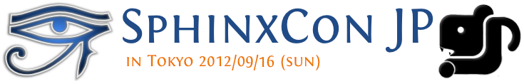

* Managing http://sphinx-users.jp

  * Full-translated reference : http://docs.sphinx-users.jp/
  * Original tutorial contents
  * Reverse dictionary

* Holding events

  * Sphinx & translation hack-a-thon
  * SphinxCon JP

.. speech::

   Sphinx users community group in Japan that was called "spinx users jp".

   Sphinx-users.jp manage original site that contains full-translated
   reference, original tutorials and reverse dictionary.

   Also we holding monthly event "Sphinx & translation hack-a-thon" and
   annual event "SphinxCon JP"

.. s6:: styles

    'div[0]': {width:'45%', position:'absolute', top:'0.3em', right:'0'},
    'div[1]': {width:'50%', position:'absolute', bottom:'1em', right:'1em'},

.. s6:: effect slide

SphinxCon JP in PyCon JP 2012
==============================

.. figure:: standing-atendees.jpg

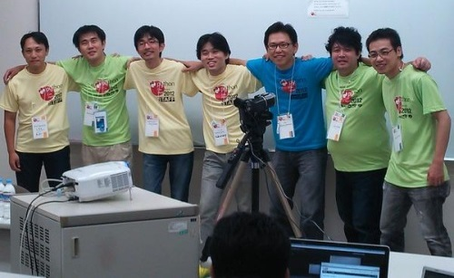

The first Sphinx event in the world!

.. speech::

   SphinxCon JP 2012 was very exciting.
   I think it is the first Sphinx event in the world!
   About 70 people were gathered on this event.
   We would like to do something in PyCon APAC of this year.

.. s6:: styles

    'div[0]': {width:'50%', position:'absolute', top:'3em', left:'0em'},
    'div[1]': {width:'30%', position:'absolute', top:'2.5em', right:'0em'},
    'div[2]': {width:'60%', position:'absolute', bottom:'0em', right:'1em'},

Gift
=======

.. 我們來玩 剪刀石頭布！じゃんけんしよう！
.. 「剪刀 石頭 布」（ジェンタオ・シートウ・プー）

Thank You!
============

.. s6:: styles

   'h2': {textAlign:'center', margin:'30% auto', background:'none'}

