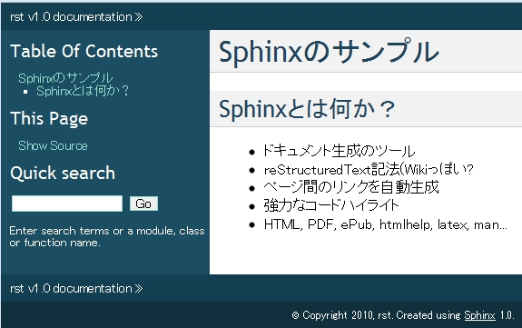

===============================
ドキュメントジェネレータSphinx
===============================

.. s6:: styles

   'h1': {marginTop:'0.5em'},

おまえ、誰よ
=============
.. figure:: face.png

* 活動:
   * Sphinxメンテナ, Sphinx-users.jp会長
   * PyCon JP 2011,2012 副座長

* 言語:
   * C++/C/8086/**Python**/Rails/chef

.. s6:: effect slide

.. s6:: styles

    'ul': {fontSize:'65%'},
    'div[0]': {width:'15%', position:'absolute', top:'1em'},

重要情報
=============

.. s6:: effect slide

.. s6:: styles

   'h2': {textAlign:'center', margin:'30% auto'}

重要情報
=============

* PyCon APAC 2013
* 2013年9月開催予定！

.. s6:: effect slide

ということで
=============

.. s6:: effect fadeScaleFromUp

.. s6:: styles

   'h2': {textAlign:'center', margin:'30% auto'}

Sphinxです
============

.. figure:: sphinx-logo.png

.. figure:: sphinxusers.jpg

.. s6:: effect slide

.. s6:: styles

   'h2': {fontSize:'120%', textAlign:'center'},
   'div[0]/img': {margin:'1em', width:'90%'},
   'div[1]/img': {margin:'1em', marginTop:0, width:'90%'},
   'div/img': {border:'0.1em gray outset'},

Sphinxとは？
=================

* ドキュメント生成のツール
* reStructuredText記法(Wikiっぽい?
* ページ間のリンクを自動生成
* 強力なコードハイライト
* 出力形式: HTML, PDF, ePub, htmlhelp, latex, man...

Sphinxの記入の例
==================

.. code-block:: rst

    Sphinxのサンプル
    =================

    Sphinxとは何か？
    -----------------
    * ドキュメント生成のツール
    * reStructuredText記法(Wikiっぽい?
    * ページ間のリンクを自動生成
    * 強力なコードハイライト
    * HTML, PDF, ePub, htmlhelp, latex, man...

.. s6:: styles

   'div[0]': {width: '50%', position:'absolute', left:'0', marginTop:'0.3em'},
   'div[0]/div/pre': {fontSize:'35%', padding:'1em'},
   'div[1]/img': {width:'70%', position:'absolute', right:'-1em', top:'2.5em'}

Sphinx 1.2b1 リリース
========================

* **3/31に1年ぶりにリリース！**

* 複数メンテナ体制で最初のリリース
* 国際化(i18n)機能の大幅強化
* マルチバイト言語対応強化

.. s6:: effect fadeScale

.. s6:: styles

   'ul/li[0]': {fontSize: '120%'},

Sphinxの国際化(i18n)機能の強化
===============================

* 翻訳対象となっていなかった多くの箇所の対応
* 公式ドキュメント多言語化(進行中)
  Sphinx国際化機能の **モデルケース**

.. s6:: effect slide

公式ドキュメント多言語化計画
=============================

* 日本語公式ドキュメントは今まで直接書き換えていました:

  .. code-block:: rst

      .. Available builders
      .. ==================

      利用可能なビルダー
      ==================

* 今は翻訳を Transifex_ で行っています

.. _Transifex: https://www.transifex.com/projects/p/sphinx-doc-1_2_0/

.. s6:: effect slide

デモ
======

.. s6:: effect slide

.. s6:: styles

   'h2': {textAlign:'center', margin:'30% auto'}

さいごに
=========

.. s6:: styles

   'h2': {textAlign:'center', margin:'30% auto', background:'none'}

PyCon APAC 2013 in Japan
===========================

* 2013年9月開催予定！

.. s6:: effect fadeScaleFromUp

