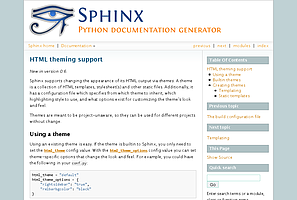
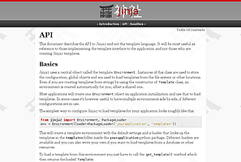

===================================================
Introduction to **Sphinx** documentation generator
===================================================

Who are you?
=============


http://about.me/shimizukawa,
@shimizukawa

* Activity:

  * Sphinx co-maintainer
  * Sphinx-users.jp chairman
  * PyCon JP 2011,2012 vice-chairman

.. s6:: effect slide

.. s6:: styles

    'div[0]': {width:'15%', position:'absolute', top:'0'},

.. speech::

   Hi everyone.
   Today I'll talk about Sphinx documentation generator.
   Thank you for opportunity of this presentation.
   Before that, let me introduce myself.

   My name is Takayuki Shimizukawa, I came from Japan.
   I joined the PyConTW last year, and it is my second time to come to Taiwan.

   My activity in Sphinx,
   I am a Sphinx co-maintainer and a Sphinx-uses.jp chariman.
   And Python, I was a vice-chairman PyCon JP in last 2 years.


Books
========

* Expert Python Programming (translation into Japanese)

  .. figure:: images/book-epp.jpg

* Python Professional Programming (2 chapters)

  .. figure:: images/book-pypro.png

  * **Python開発実戦**

.. s6:: effect slide

.. s6:: styles

   'ul/li[0]/p': {width: '50%', marginBottom:'0.5em'},
   'ul/li[0]/div': {width:'30%', left:'55%', top:'1em'},
   'ul/li[1]': {marginLeft: '2em'},
   'ul/li[1]/p': {width: '50%'},
   'ul/li[1]/div': {width:'30%', right:'0', bottom:'0em'},
   'ul/li[1]/ul/li[0]': {display:'none'},
   'ul': {fontSize:'70%'},

.. s6:: actions

   ['ul/li[1]/ul/li', 'fade in', '0.3'],

.. speech::

   Books.

   * I want to show you my books. There are 2 books so far, each books tell
     you about Python Programming. Writing books is one of my most
     interesting skills.

   .. * The "Expert Python Programming" that written by Tarek Ziade in 2008.
   ..   I and other 3 members translated in 2010, about 3 years ago.
   ..
   .. * In 2012, The "Python Professional Programming" was written by 14
   ..   colleagues of the company I belong. I wrote two chapters.

   * The books mention to Sphinx and Documentations.

   * "Python Professional Programming" was already translated into
     'simple chineese charactors' and will publish in June.


anyway.
=========


.. s6:: styles

   'h2': {textAlign:'center', margin:'30% auto', lineHeight:'1.5em'}


The Sphinx
============

.. figure:: images/sphinx-logo.png

.. speech::

   The Sphinx.
   Today, I'll talk about documentation generator that is called "Sphinx".


.. s6:: effect fadeScaleFromUp

.. s6:: styles

   'h2': {fontSize:'120%', textAlign:'center'},
   'div[0]/img': {margin:'20% 10%', width:'90%'},
   'div/img': {border:'0.1em gray outset'},

Table of contents
==================

1. Introduction
2. Demonstration
3. Case studies

.. speech::

   I will tell about Sphinx by three parts.
   Introduction, Demonstration and Case studies.

.. s6:: effect slide

Table of contents
====================
1. Introduction

   * Introduces the Sphinx and reStructuredText.
   * Sphinx extensions.
   * Comparison with other documentation tools.

2. Demonstration
3. Case studies

.. speech::

   First, I'll introduce "what is Sphinx" and "what is reStructuredText".
   By the way, how many people already using Sphinx?

   OK, please raise your hands for about "Do you know Sphinx?" Thank you.
   And next, "Did you use Sphinx already?" Thanks.


.. s6:: styles

   'ol': {color: 'gray'},
   'ol/li[0]/ul/li[0]': {color: 'white'},


What **IS** Sphinx?
=====================

.. speech::

   What is Sphinx?

.. s6:: styles

   'h2': {textAlign:'center', margin:'30% auto', lineHeight:'1.5em'}

.. s6:: effect slide


Sphinx **IS**
===============

* Documentation generator.
* Sphinx generate documentation from reStructuredText markup.
* Extendable.

.. figure:: images/sphinx-generate-several-formats.png

.. speech::

   * Sphinx is a documentation generator.
     Sphinx generate documentation from reStructuredText markup.

     In other words, Sphinx reads reST text file and
     outputs html, epub, pdf, or other several formats.

   * Sphinx is extendable, so you can also output in a different format,
     or read the file in a different format.


.. s6:: styles

   'div': {width:'55%', position:'absolute', right:'0', bottom:'1em', backgroundColor:'white'}

.. s6:: effect slide

And reStructuredText(reST) **IS**
==================================

* Markup language.
* Written with plain text.
* Similer to several wiki markups.
* Extendable **(important!)**

There is markup sample:

.. code-block:: rst

   reStructuredText_ (*reST*) is **markup** language.
   :rst:role:`role` and :rst:dir:`directive` is extendable.

   .. _reStructuredText: http://docutils.sourceforge.net/docs/ref/rst/restructuredtext.html


.. speech::

   And reStructuredText reST is markup language.

   * It was written with plain text.
   * reST is similer to other wiki like markups but different from others,
     the reST syntax is extendable. It's a important point.

   This is a markup sample that contains LINK, EMPHASIS, STRONG and ROLE.

.. s6:: styles

   'ul': {fontSize: '80%'},
   'div': {fontSize: '80%'},

.. s6:: effect slide


Sphinx extends reST syntax
===========================

Sphinx provides many useful reST :term:`directive` and :term:`role`.

* :ref:`code-block <code-examples>`: Code highlight directive
* :rst:role:`doc`, :rst:role:`ref`, :rst:role:`term`:
  Link to other pages roles and directives
* :rst:dir:`math`: Numerical formula directive
* :rst:dir:`only`: Conditional output directive.
* :rst:dir:`automodule`: Auto documenter from .py directive.
* :ref:`domains <domains>`: Some domains directives and roles: C, C++, JavaScript, Python, reST.

.. speech:: 

   Sphinx provides many useful reST directive and role.

   * *code-block* for code highlighting.
   * *doc*, *ref*, *term*, these roles make link to other pages.
   * *math* role and directive render numerical formula.
   * *only* directive works as conditional output control.
   * *automodule* generate module reference document from .py file.
   * Some domains directives and roles: C, C++, JavaScript, Python, reST
     to easy to write class or function's descriptions.
     I'll do demonstration later.

.. s6:: styles

   'ul': {fontSize: '60%'},
   'p': {fontSize: '70%'},

.. s6:: effect slide


Sphinx includes
====================

Simple and beautiful html themes. Detail information is here: :ref:`builtin-themes`.

.. figure:: images/theme-default.png

   default



   sphinxdoc



   scrolls

.. figure:: images/theme-agogo.png

   agogo

.. figure:: images/theme-traditional.png

   traditional

.. figure:: images/theme-nature.png

   nature

.. figure:: images/theme-haiku.png

   haiku

.. figure:: images/theme-pyramid.png

   pyramid


.. speech::

   Sphinx includes simple and beautiful html themes.
   Each themes are called:
   default, sphinxdoc, scrolls, agogo, traditional, nature, haiku and pyramid.

   Detail information is written at builtin themes page.


.. s6:: styles

   'div[0]': {fontSize:'60%', width:'23%', float:'left', margin:'0.2em 0 0.2em 0.5em'},
   'div[1]': {fontSize:'60%', width:'23%', float:'left', margin:'0.2em 0 0.2em 0.5em'},
   'div[2]': {fontSize:'60%', width:'23%', float:'left', margin:'0.2em 0 0.2em 0.5em'},
   'div[3]': {fontSize:'60%', width:'23%', float:'left', margin:'0.2em 0 0.2em 0.5em'},
   'div[4]': {fontSize:'60%', width:'23%', float:'left', margin:'0.2em 0 0.2em 0.5em'},
   'div[5]': {fontSize:'60%', width:'23%', float:'left', margin:'0.2em 0 0.2em 0.5em'},
   'div[6]': {fontSize:'60%', width:'23%', float:'left', margin:'0.2em 0 0.2em 0.5em'},
   'div[7]': {fontSize:'60%', width:'23%', float:'left', margin:'0.2em 0 0.2em 0.5em'},

.. s6:: effect slide

There are 3rd party themes
============================

You can find 3rd-party Sphinx themes at PyPI or other sites. For example,

.. figure:: images/theme-bizstyle.png
   :target: https://pypi.python.org/pypi/sphinxjp.themes.bizstyle

   bizstyle_


   dotted_

.. figure:: images/theme-basicstrap.png
   :target: https://pypi.python.org/pypi/sphinxjp.themes.basicstrap

   basicstrap_

.. figure:: images/theme-sphinxjp.png
   :target: https://pypi.python.org/pypi/sphinxjp.themes.sphinxjp

   sphinxjp_

And presentation themes:


   s6_


   htmlslide_


   impressjs_

.. s6:: styles

   'div[0]': {fontSize:'60%', width:'23%', float:'left', margin:'0.2em 0 0.2em 0.5em'},
   'div[1]': {fontSize:'60%', width:'23%', float:'left', margin:'0.2em 0 0.2em 0.5em'},
   'div[2]': {fontSize:'60%', width:'23%', float:'left', margin:'0.2em 0 0.2em 0.5em'},
   'div[3]': {fontSize:'60%', width:'23%', float:'left', margin:'0.2em 0 0.2em 0.5em'},
   'div[4]': {fontSize:'60%', width:'23%', float:'left', margin:'0.2em 0 0.2em 0.5em'},
   'div[5]': {fontSize:'60%', width:'23%', float:'left', margin:'0.2em 0 0.2em 0.5em'},
   'div[6]': {fontSize:'60%', width:'23%', float:'left', margin:'0.2em 0 0.2em 0.5em'},
   'p': {clear:'both'},

.. speech::

   There are 3rd party themes.
   You can find 3rd-party Sphinx themes at PyPI or other sites. For example,
   bizstyle, dotted, basicstrap and sphinxjp.

   And few presentation themes are also exist:
   s6, htmlslide, impressjs.

   BTW, this presentation slide was also built by Sphinx with s6 theme.


.. s6:: effect slide


.. _bizstyle: https://pypi.python.org/pypi/sphinxjp.themes.bizstyle
.. _dotted: https://pypi.python.org/pypi/sphinxjp.themes.dotted
.. _basicstrap: https://pypi.python.org/pypi/sphinxjp.themes.basicstrap
.. _sphinxjp: https://pypi.python.org/pypi/sphinxjp.themes.sphinxjp
.. _s6: https://pypi.python.org/pypi/sphinxjp.themes.s6
.. _htmlslide: https://pypi.python.org/pypi/sphinxjp.themes.htmlslide
.. _impressjs: https://pypi.python.org/pypi/sphinxjp.themes.impressjs


What **IS NOT** Sphinx?
========================

.. speech:: So, I'll also introduce Sphinx is not possible.

.. s6:: styles

   'h2': {textAlign:'center', margin:'30% auto', lineHeight:'1.5em'}


What **IS NOT** Sphinx?
========================

* Are there *GUI frontend editor?*
   * **NO.**

.. figure:: images/sphinx-have-no-gui-frontend.png

   Windows Notepad

.. speech::

   Sphinx did not have GUI frontend as like as Word.
   But you can choose any GUI editor to edit reST plain text.

.. s6:: styles

   'div': {width:'60%', margin:'1em auto'},

.. s6:: effect slide

What **IS NOT** Sphinx?
========================

* There is a way to import/export *Word*?
   * **NO..!**


   `Some rights reserved by motorpsykhos <http://www.flickr.com/photos/motorpsykhos/74145785/>`_

.. speech::

   Sphinx did not have a way to import Word file.
   However, there is a experimental implementation to build Word docx file,
   but it is not stable.

.. s6:: styles

   'div': {width:'80%', margin:'-1em auto 0', zIndex:'-1', fontSize:'70%'},

.. s6:: effect slide

What **IS NOT** Sphinx?
========================

* There is a way to export to *PowerPoint*?
   * **NO.....!!!**

.. figure:: images/no2.jpg

   `Some rights reserved by el__vaquero <http://www.flickr.com/photos/twbriggs/4245079902/>`_

.. speech::

   3rd-party theme will support to make presentation slide by using Sphinx.
   But it is controlled by HTML, css and JavaScript.
   It is not easy to convert PowerPoint file format.

.. s6:: styles

   'div': {width:'75%', margin:'-1em auto 0', zIndex:'-1', fontSize:'70%'},

.. s6:: effect slide

What **IS NOT** Sphinx?
========================

* Are there a way to export to *Excel*?
   * **What are you saying???**


   `Some rights reserved by extranoise <http://www.flickr.com/photos/extranoise/270597628/>`_

.. speech::

   Do you know Excel HOUGAN-SHI? HOUGAN-SHI means "Squares of paper".
   In Japan, many many documentations has been made with Excel HOUGAN-SHI.
   It is not feasible I think because it is not easy to maintenance and
   not easy to recognize difference by changing.

.. s6:: styles

   'div': {width:'80%', margin:'-1em auto 0', zIndex:'-1', fontSize:'70%'},

.. s6:: effect slide

Conclusion: Sphinx **IS**
===========================

* Documentation generator.
* Read reST and write several file formats.
* Extends reST syntax and provides many useful
  *roles* and *directives*.
* Contains many beautiful HTML themes.
* Extendable.

.. speech::

   (read slide.)

.. s6:: styles

    'ul/li': {display:'none'}

.. s6:: actions

    ['ul/li[0]', 'fade in', '0.3'],
    ['ul/li[1]', 'fade in', '0.3'],
    ['ul/li[2]', 'fade in', '0.3'],
    ['ul/li[3]', 'fade in', '0.3'],
    ['ul/li[4]', 'fade in', '0.3'],

.. s6:: effect slide

Next.
======

.. s6:: styles

   'h2': {textAlign:'center', margin:'30% auto', lineHeight:'1.5em'}

.. s6:: effect slide

Table of contents
====================
1. Introduction

   * Introduces the Sphinx and reStructuredText.
   * Sphinx extensions.
   * Comparison with other documentation tools.

2. Demonstration
3. Case studies

.. s6:: styles

   'ol': {color: 'gray'},
   'ol/li[0]/ul/li[1]': {color: 'white'},


Included official extensions
==============================

* *autodoc*: Auto documenter for Python modules.
* *pngmath* or *jsmath*: provides :rst:dir:`math` directive and role.
* *intersphinx*: Link other documents over internet.
* *graphviz*: Draw graphics by using graphviz.
* *todo*: List-up todo directives.
* *doctest*: run doctesting for code snippets in the document.
* *coverage*: provide "make coverage" feature to get documentation coverage.

.. speech::

   Several official extensions are included in the Sphinx
   that are maintained by sphinx comitters.

   autodoc, math, intersphinx, graphviz, todo, ...
   For about some extensions, I'll do demonstration later.

.. s6:: styles

   'ul/li': {fontSize: '80%'},

.. s6:: effect slide

Many 3rd-party extensions
===========================

Contributed extensions:

* *blockdiag*: Rendering some type of diagrams from plain-text like graphviz.
* Domains: ada, coffee, erlan, http, php, ruby.
* or else.

And other extensions:

* Some type of html themes (bizstyle, s6, ...)
* Some type of builders (textile, docx, ...)

.. speech::

   You can find several extensions contributed by users in the
   `Sphinx Contrib`_ repository like these:

   And you can find some extensions in PyPI. For example, Some type of html
   themes like bizstyle or s6. and some type of builders like textile or docx.


.. s6:: styles

   'ul/li': {fontSize: '80%'},
   'p': {fontSize: '80%'},

.. s6:: effect slide

.. _Sphinx Contrib: https://www.bitbucket.org/birkenfeld/sphinx-contrib

Next.
======

.. s6:: styles

   'h2': {textAlign:'center', margin:'30% auto', lineHeight:'1.5em'}

.. s6:: effect slide

Table of contents
====================
1. Introduction

   * Introduces the Sphinx and reStructuredText.
   * Sphinx extensions.
   * Comparison with other documentation tools.

2. Demonstration
3. Case studies

.. s6:: styles

   'ol': {color: 'gray'},
   'ol/li[0]/ul/li[2]': {color: 'white'},

Compare with other tools
=========================

* Word like office app
* Wiki

.. s6:: effect slide

Sphinx vs Office
=================

.. list-table::
   :header-rows: 1
   :stub-columns: 1
   :widths: 10 45 45

   - - VS
     - Sphinx
     - Office

   - - Files
     - Many files/dirs
     - 1 monolithic file

   - - Format
     - Plain text
     - Binary file

   - - GUI
     - No GUI frontend
     - Must use GUI

   - - Begin
     - Need learning to write
     - Easy to use

   - - Restructuring
     - Easy
     - Difficult

   - - Versioning
     - With hg/git/..
     - By self

   - - Match to
     - Work with program source
     - Others

.. speech::

   Honestly, Word have powerful features as versioning or parallel editiong or
   some other features. But I think these features are hid to casual users.

.. s6:: styles

   'table': {fontSize:'60%', margin:'1em'},

.. s6:: effect slide


Sphinx vs Wiki
================

.. list-table::
   :header-rows: 1
   :stub-columns: 1
   :widths: 15 40 40

   - - VS
     - Sphinx
     - Wiki

   - - Structure
     - 1 tree
     - Semi-lattice

   - - Root and path
     - 1 root and 1 path from start to end
     - No root and no order to read

   - - Cross reference
     - exists
     - exists

   - - Glossary
     - exists
     - exists

   - - Index
     - exists
     - exists

   - - Match to
     - Books, order to read is important
     - Dictionary

.. speech::

   Sphinx is suitable for the text like a book or a paper.

   The particle size of Wiki pages are small, it is suitable for the
   dictionary that does not depend on the order in which they read.


.. s6:: styles

   'table': {fontSize:'60%', margin:'1em'},

.. s6:: effect slide


Next.
======

.. s6:: styles

   'h2': {textAlign:'center', margin:'30% auto', lineHeight:'1.5em'}

.. s6:: effect slide

Table of contents
====================
1. Introduction
2. Demonstration
3. Case studies

.. s6:: styles

   'ol': {color: 'gray'},
   'ol/li[1]': {color: 'white'},


Sphinx installation
=====================

Install from PyPI:

.. code-block:: bash

  $ easy_install Sphinx
  Searching for Sphinx
  Reading http://pypi.python.org/simple/Sphinx/
  Best match: Sphinx 1.2b1
  ...
  Finished processing dependencies for Sphinx

Sphinx and other dependency packages are installed.
Sphinx 1.2b1 is current newest version.

.. speech::

   Install from PyPI by using easy_install.

   easy_install is defacto standard package installer.
   There are other installation methods: pip, buildout or invoke setup.py.
   In this case I used easy_install.

   This command installed Sphinx and other dependency packages.
   Sphinx 1.2b1 is current newest version.

.. s6:: styles

   'p': {fontSize:'70%'},
   'div': {fontSize:'70%'},

.. s6:: effect slide

Sphinx quick start
=====================

Generate a scaffold by using sphinx-quickstart:

.. code-block:: bash

   $ sphinx-quickstart sample
   (many interactive questions)

Generated files are:

.. code-block:: bash

   $ cd sample
   $ ls -a
   ./          Makefile    _static/    conf.py*    make.bat*
   ../         _build/     _templates/ index.rst

Run :command:`make html` to build html output:

.. code-block:: bash

   $ make html

.. speech::

   sphinx-quickstart command generate Sphinx documentation scaffold.
   And then, you can use ``make html`` command to build html output
   soon.

   Generated html files are in _build/html directory.

.. s6:: styles

   'p': {fontSize:'70%'},
   'div': {fontSize:'70%'},


.. s6:: effect slide


Demo menu
==============

#. Bullet list
#. Numbered list
#. Code highlight
#. Link to other pages
#. Numerical formula
#. todo extension
#. autodoc extension
#. Link over internet
#. Domains
#. Internationalization
#. blockdiag extension

.. s6:: styles

   'ol': {fontSize:'60%'},

.. speech::

   Ok, preparation is done.
   Let me show you the demonstrations.

.. s6:: effect slide

*demo:* Bullet list
=====================

.. code-block:: rst

   Some text line.
   Second line will joined to 1st line.

   * item 1
   * item 2

     * item 2-1
     * item 2-2

   * item 3

.. tip:: You need blank line before and after nested items. And nested items need 2 spaces before ``*``.

.. s6:: styles

   'p': {fontSize:'70%'},
   'div': {fontSize:'70%'},

.. s6:: effect slide


*demo:* Numbered list
=====================

.. code-block:: rst

   1. item 1
   2. item 2

      #. item 2-1
      #. item 2-2

   3. item 3


.. tip:: `#.` rendering auto numbered list. but it is not human readable.

.. speech::

   "number plus dot" or "sharp plus dot" render numbered list.

.. s6:: effect slide


*demo:* Code highlight
======================

Use ``code-block`` directive to rendering code with highlighting.

.. code-block:: rst

   .. code-block:: ruby

      class Foo
        def initialize(value)
          puts "value = #{value}"
        end
      end

.. note:: This directive was provided by sphinx. The same feature is provided by docutils-0.9 as :rst:dir:`code` directive.

.. s6:: styles

   'p': {fontSize:'70%'},
   'div': {fontSize:'70%'},

.. s6:: effect slide


*demo:* Link to other pages
===========================

Use :rst:dir:`toctree` directive to build a tree structure.

.. code-block:: rst

   .. toctree::
      :numbered:
      :maxdepth: 2

      spam
      egg

.. note:: This directive was provided by sphinx.

.. s6:: effect slide

*demo:* Link to other pages
===========================
Link between pages by using :rst:dir:`glossary` directive and :rst:role:`term` role:

.. code-block:: rst

   .. glossary::

      Sphinx
         Sphinx is a docmentation generator.

      reStructuredText
         reST is markup language to make structured document.

   These glossary terms are linked from other pages
   by using `term` role like :term:`Sphinx`.

.. s6:: styles

   'p': {fontSize:'70%'},
   'div': {fontSize:'70%'},

*demo:* Link to other pages
===========================
Link between pages by using :rst:role:`doc` role:

.. code-block:: rst

   Link to another reST page with :doc:`subdir/index`.
   `subdir/index` will be replaced with title of
   that's document file.

.. s6:: styles

   'p': {fontSize:'70%'},
   'div': {fontSize:'70%'},


*demo:* Link to other pages
===========================
Link between pages by using reST `label` and :rst:role:`ref` role:

.. code-block:: rst

   .. _title-of-section:

   Title of section
   ==================

   Make page internal link to section header can
   be done with `Title of section`_ link syntax.
   However, if you want to link from other pages
   as same as this, you can be done with
   :ref:`title-of-section`. The label name will be
   replaced with section title.

.. s6:: styles

   'p': {fontSize:'70%'},
   'div': {fontSize:'70%'},


*demo:* Numerical formula
=========================

Use :rst:dir:`math` directive to rendering numerical formula.

.. code-block:: rst

   Pythagoras theorem is :math:`a^2 + b^2 = c^2`.

   .. math:: (a + b)^2 = a^2 + 2ab + b^2

   .. math::
      :nowrap:

      \begin{eqnarray}
         y    & = & ax^2 + bx + c \\
         f(x) & = & x^2 + 2xy + y^2
      \end{eqnarray}

.. note:: This directive was provided by sphinx. Same name directive was provided by docutils-0.8 or later, but it is bit different.

.. s6:: styles

   'p': {fontSize:'60%'},
   'div': {fontSize:'70%'},

.. s6:: effect slide


*demo:* todo extension
=========================

Add :mod:`sphinx.ext.todo` extension in conf.py:

.. code-block:: python

   extensions = [
       'sphinx.ext.todo',
   ]

Then you can use :rst:dir:`todo` directive:

.. code-block:: rst

   .. todo:: write test for this function.

and  :rst:dir:`todolist` directive:

.. code-block:: rst

   .. todolist::


.. s6:: effect slide


*demo:* autodoc extension
=========================

Add :mod:`sphinx.ext.autodoc` extension in conf.py:

.. code-block:: python

   extensions = [
       'sphinx.ext.autodoc',
   ]

Then you can use :rst:dir:`automodule` directive:

.. code-block:: rst

   .. automodule:: person
      :members:

.. s6:: effect slide


*demo:* Link over internet
===========================

Add :mod:`sphinx.ext.intersphinx` extension and intersphinx setting in conf.py:

.. code-block:: python

   extensions = [
       'sphinx.ext.autodoc',
       'sphinx.ext.intersphinx',  #<- added
   ]

   intersphinx_mapping = {
      'py': ('http://docs.python.jp/2/', None),
   }

Then your linking markups link remote pages:

.. code-block:: rst

   This markup link to Python's official reference page:
   :py:function:`urllib.urlopen` on the :mod:`urllib` page.

.. speech::

   Linking to other published Sphinx document by using same syntax to link
   to internal pages.

.. s6:: styles

   'p': {fontSize:'60%'},
   'div': {fontSize:'70%'},

.. s6:: effect slide

*demo:* Domains
================

A domain is a collection of markup (directives and roles) to describe and link to objects belonging together.

.. code-block:: rst

   .. py:function:: event.register(event_id, user_name)

      (description for this function here).

   You can use :py:func:`event.register` to register.

* ``:py:func:`event.register``` is *py* domain's *func* role that make lnik to the declaration line.
* ``.. py:function:: event.register(event_id, user_name)`` is *py* domain's *function* directive that make declaration of the function and create Sphinx's index page entry.

.. speech::

   What is domain? A domain is a collection of markup (reStructuredText
   directives and roles) to describe and link to objects belonging together.

   For example. In this case, ``:py:func:`event.register``` is *py* domain's
  *func* role that make lnik to the declaration line.

   ``.. py:function:: event.register(event_id, user_name)`` is *py* domain's
   *function* directive that make declaration of the function and create
   Sphinx's index page entry.

   Sphinx contains several domains and sphinx-contrib contains more useful
   domains.

.. s6:: styles

   'p': {fontSize:'60%'},
   'div': {fontSize:'60%'},
   'ul': {fontSize:'60%'},

.. s6:: effect slide


*demo:* Internationalization
================================

Sphinx generate po files for internationalization(i18n).
`sphinx-intl`_ also support your work.

.. code-block:: bash

   $ easy_install sphinx-intl

Generate pot files and create specified po files.

.. code-block:: bash

   $ make gettext
   $ sphinx-intl update -p _build/locale -l zh_TW

And next, you need translate po files in `locale/` sub dirs.
When you did that, set `language='zh_TW'` in the conf.py to use translated
po files.

.. code-block:: bash

   $ sphinx-intl build
   $ make html

Ok, you can get the translated HTML.

.. speech::

   Sphinx generate pot files for internationalization(i18n).
   `sphinx-intl`_ also support your work that is 3rd-party tool
   then you need install this by using easy_install.

   Generate po files can be done with :command:`make getext` command.
   And next, you need translate po files in `locale/` sub dirs.
   When you did that, set `language='zh_TW'` in the conf.py to use
   translated po files.

   :command:`sphinx-intl build` compile po files into mo files.
   Finally you can get the translated html by :command:`make html`.

.. s6:: styles

   'p': {fontSize:'60%'},
   'div': {fontSize:'60%'},

.. s6:: effect slide


*demo:* blockdiag extensions
=============================

Blockdiag extensions is 3rd party extension for sphinx.
Install :ref:`sphinxcontrib-blockdiag` extension:

.. code-block:: bash

   $ easy_install Pillow
   $ easy_install sphinxcontrib-blockdiag
   $ easy_install sphinxcontrib-seqdiag
   $ easy_install sphinxcontrib-actdiag
   $ easy_install sphinxcontrib-nwdiag


.. note::

   Pillow is successor of PIL (Python Imaging Library) that support
   Python3 and 64bit binary distributions.

.. s6:: styles

   'p': {fontSize:'70%'},
   'div': {fontSize:'70%'},

.. s6:: effect slide

*demo:* blockdiag extension
===========================

Add ``sphinxcontrib.blockdiag`` extension in conf.py:

.. code-block:: python

   extensions = [
       'sphinx.ext.autodoc',
       'sphinx.ext.intersphinx',
       'sphinxcontrib.blockdiag',  #<- added
   ]

Then you can use ``blockdiag`` directive:

.. code-block:: rst

   .. blockdiag::

      {
          A [label="自己"];
          A -> B [label="Open"];
          A -> C;

          O -> P -> C;
      }

.. s6:: styles

   'p': {fontSize:'60%'},
   'div': {fontSize:'60%'},

.. s6:: effect slide


*demo:* seqdiag extension
===========================

Add ``sphinxcontrib.seqdiag`` extension in conf.py:

.. code-block:: python

   extensions = [
       'sphinx.ext.autodoc',
       'sphinx.ext.intersphinx',
       'sphinxcontrib.blockdiag',
       'sphinxcontrib.seqdiag',  #<- added
   ]

Then you can use ``seqdiag`` directive:

.. code-block:: rst

   .. seqdiag::

      {
          A  => B;
          A  -> B;
          A <-- B;

          A => C => D;
      }

.. s6:: styles

   'p': {fontSize:'60%'},
   'div': {fontSize:'60%'},

.. s6:: effect slide


Next.
======

.. s6:: styles

   'h2': {textAlign:'center', margin:'30% auto', lineHeight:'1.5em'}

.. s6:: effect slide

Table of contents
==================

1. Introduction
2. Demonstration
3. Case studies

   * Sphinx official reference
   * Blog

.. speech::

   At last, I'll introduce few case studies.

.. s6:: styles

   'ol': {color: 'gray'},
   'ol/li[2]': {color: 'white'},

.. s6:: effect slide


Sphinx official reference
==========================

.. figure:: images/sphinx-doc.png
   :target: http://sphinx-doc.org/index.html

   http://sphinx-doc.org/index.html

.. speech::

   Of course, Sphinx official reference is created by using Sphinx.

.. s6:: styles

   'div': {width:'60%', margin:'1em auto'},


.. s6:: effect slide

Sphinx official reference
==========================

Using :mod:`sphinx.ext.autodoc`.


   source


   :ref:`storagebackends`


.. speech::

   For instance, Sphinx API part for developers is describing
   reference of functions and classes that was generated by autodoc.

.. s6:: styles

   'div[0]': {width:'45%', position:'absolute', left:'1em', top:'3em'},
   'div[1]': {width:'60%', position:'absolute', right:'0', bottom:'1em'},

.. s6:: effect slide


Sphinx Japanese reference
==========================

Using :ref:`intl` and Transifex_.


   http://docs.sphinx-users.jp/

`sphinx-intl`_ also support your work.


.. speech::

   And internationalization. This Japanese translated reference page in the
   sphinx-users.jp was generated by Sphinx with Japanese translation
   catalog that was imported from Transifex.

   Transifex will help you to translate in a team.
   And `sphinx-intl`_ also support your work.


.. s6:: styles

   'p': {fontSize:'70%'},
   'div': {width:'55%', margin:'1em auto 0', fontSize:'70%'},

.. s6:: effect slide

.. _Transifex: https://www.transifex.com/projects/p/sphinx-doc-1_2_0/
.. _`sphinx-intl`: http://pypi.python.org/pypi/sphinx-intl


.. Sphinx Japanese reference
.. ==========================
.. 
.. .. speech::
.. 
..    BTW, Japanese translated reference is generated and is uploaded
..    automatically at translation on the Transifex was changed.
..    Transifex's web hook invoke `drone.io`_ CI service.
.. 
.. .. s6:: effect slide


Blog
=====

.. figure:: images/tinkerer.png
   :target: http://tinkerer.me/

   http://tinkerer.me/

.. speech::

   Tinkerer is a blog tool made by using the Sphinx.
   You can be written your blog in reStructuredText format.
   In addition, you can use the rich Sphinx extensions.


.. s6:: styles

   'div': {width:'80%', margin:'1em auto 0', fontSize:'80%'},

.. s6:: effect slide


Blog with Tinkerer
====================

Create a new blog:

.. code-block:: bash

   $ mkdir blog
   $ cd blog
   $ tinker -s

And setup blog title or else:

.. code-block:: bash

   $ vi conf.py

And create a blog entry file and write in reST:

.. code-block:: bash

   $ tinker -p "first post"
   $ vi 2013/05/25/first_post.rst

Finally, build command generates HTML and RSS:

.. code-block:: bash

   $ tinker -b

.. speech::

   Tinkerer provides original commands to manage your blog;
   create a new blog, create a blog entry, build html.

   (read slide)

   Tinkerer make it easier to write a blog.


.. s6:: styles

   'div': {fontSize:'70%', margin:'0 auto'},
   'p': {fontSize:'60%', margin:'0'},

.. s6:: effect slide


That's all
==============

.. s6:: styles

   'h2': {textAlign:'center', margin:'30% auto', background:'none'}

Questions?
==============

.. s6:: styles

   'h2': {textAlign:'center', margin:'30% auto', background:'none'}


Information
============

.. s6:: styles

   'h2': {textAlign:'center', margin:'30% auto', background:'none'}

.. speech::

   I'd like to introduce PyCon APAC 2013 in this autumn and
   Sphinx users community in Japan.


PyCon APAC 2013 in Japan
==========================

.. figure:: images/pyconapac2013.png

* Schedule:

  * Conference: Sep, 14(Sat) 15(Sun)
  * Sprint: Sep, 16(Mon)

* Location:

  * Tokyo Shinjuku, Japan

* Registration:

  * Start at middle of June, (maybe)

.. speech::

   We will hold 3-days Python event at September 14, 15, 16.

   Registration of this event will start at middle of June.


.. s6:: styles

    'div[0]': {width:'17%', position:'absolute', top:'4em', right:'0'},

.. s6:: effect slide

Sphinx-users.jp
================

.. figure:: images/sphinxusers.jpg

.. figure:: images/SphinxConJP2012-logo.png

* Managing http://sphinx-users.jp

  * Full-translated reference : http://docs.sphinx-users.jp/
  * Original tutorial contents
  * Reverse dictionary

* Holding events

  * Sphinx & translation hack-a-thon
  * SphinxCon JP

.. speech::

   Sphinx users community group in Japan that was called "spinx users jp".

   The group manage original site that contains full-translated
   reference, original tutorials and reverse dictionary.

   Also we holding monthly event "Sphinx & translation hack-a-thon" and
   annual event named "SphinxCon JP"

.. s6:: styles

    'div[0]': {width:'45%', position:'absolute', top:'0.3em', right:'0'},
    'div[1]': {width:'50%', position:'absolute', bottom:'1em', right:'1em'},

.. s6:: effect slide

SphinxCon JP in PyCon JP 2012
==============================


.. figure:: images/standing-atendees.jpg


The first Sphinx event in the world!

.. speech::

   SphinxCon JP at last year was very exciting.
   I think it is the first Sphinx event in the world!
   About 70 people were gathered on this event.
   We would like to do something in PyCon APAC of this year too.
   Please join to PyCon APAC!


.. s6:: styles

    'div[0]': {width:'50%', position:'absolute', top:'3em', left:'0em'},
    'div[1]': {width:'30%', position:'absolute', top:'2.5em', right:'0em'},
    'div[2]': {width:'60%', position:'absolute', bottom:'0em', right:'1em'},

Gift from Sphinx-users.jp!
===========================


* 2 Sphinx T-Shirt, SIZE S and XXL
* Let's decide by rock-paper-scissors!

  * 我們來玩 剪刀石頭布！


.. speech::

   I've brought 2 Sphinx T-Shirt, this is gift from Sphinx-users.jp.
   But I have only 2 size; S or XXL.

   Do you want this T-shirt? please raise your hands!
   Ok, Let's decide by "rock-paper-scissors" (ジェンタオ・シートウ・プー)!
   (What did you call to do that?)
   (Please let me know anytime.)


.. 我們來玩 剪刀石頭布！じゃんけんしよう！
.. 「剪刀 石頭 布」（ジェンタオ・シートウ・プー）

.. s6:: styles

   'div': {width: '50%', margin:'1em auto 0', display:'none'},
   'ul/li': {display:'none'},

.. s6:: actions

   ['div', 'fade in', '0.3'],
   ['ul/li[0]', 'fade in', '0.3'],
   ['ul/li[1]', 'fade in', '0.3'],


Thank You!
============

.. s6:: styles

   'h2': {textAlign:'center', margin:'30% auto', background:'none'}

